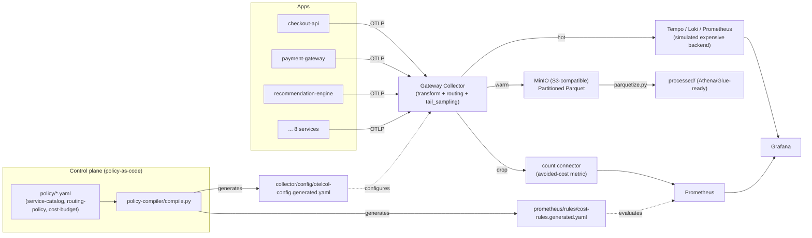

# Architecture — otel-telemetry-cost-governance

## Context and problem

Observability backends charge by ingested volume. The naive response to
high cost is either "sample everything equally" or "send everything to the
expensive backend and pray" — both destroy either SLO fidelity or the
budget. This project proposes a third way: **routing telemetry by value**,
decided by a centralized, versioned policy, not configuration scattered
across each collector.

## Overview

## Why two tiers (Agent + Gateway) in production

In the local demo, the telemetry-generator talks OTLP directly to the
Gateway Collector — there's no separate Agent Collector (that would be
over-engineering for a portfolio demo). In production, the recommended
topology is:

- **Agent Collectors** (DaemonSet, one per host/service): only receive and
  forward via OTLP, with no policy logic. They live close to the
  application and absorb local spikes.
- **Gateway Collector fleet** (stateless, horizontally scalable): all the
  tagging/routing/sampling/cost logic lives here, centralized.

This avoids the most common mistake in large fleets: routing policy copied
across dozens of host-level collectors and silently drifting apart.

## Control plane: policy-as-code + policy-compiler

`policy/service-catalog.yaml`, `policy/routing-policy.yaml`, and
`policy/cost-budget.yaml` are the single source of truth, readable and
reviewable in a PR. `policy-compiler/compile.py`:

1. Validates the three files against a JSON Schema (`policy-compiler/schema/`).
2. Compiles the decision matrix into OTTL expressions inside a
   `transformprocessor` (tagging `service.tier`/`team`/`cost_center` +
   deciding `telemetry.tier`).
3. Generates the `routingconnector` that splits hot/warm/drop.
4. Generates the Prometheus cost recording rules from the same
   `cost-budget.yaml` (a single source feeding both outputs).
5. Attaches a `policy.version` (a hash of the active policy) to every
   routed signal — for auditing "under which policy was this data
   classified."

## Production path for dynamic management: OpAMP

The demo uses a pragmatic "poor man's OpAMP" mechanism: periodically run
`make recompile-policy-with-budget`, which queries Prometheus for
over-budget services and recompiles + restarts the Collector. That's enough
to demonstrate the concept, but it has a real limitation: it requires a
Collector restart on every policy change.

In production, the natural evolution is
**OpAMP (Open Agent Management Protocol)** — a project under the
OpenTelemetry/CNCF umbrella — which enables:

- Pushing configuration to the entire Gateway Collector fleet without
  restarts.
- Health and active-policy-version reporting per collector (drift
  visibility).
- Centralized rollback if a new policy causes a regression.

Not implemented in this project (out of scope for a local demo), but it's
the natural next step documented here to make clear the policy-compiler was
already designed to be compatible with that evolution (it already produces
a versioned configuration artifact, independent of the distribution
mechanism).

## Routing decisions — see docs/routing-policy.md

## Cost model — see docs/cost-model.md

## How to run and validate — see docs/runbook.md
