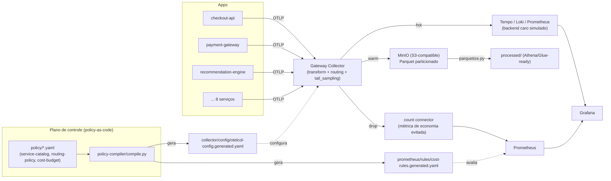

# Arquitetura — otel-telemetry-cost-governance

## Contexto e problema

Backends de observabilidade cobram por volume ingerido. A resposta ingênua a
custo alto é "sample tudo igual" ou "manda tudo pro backend caro e reza" —
ambas destroem fidelidade de SLO ou destroem o orçamento. Este projeto propõe
uma terceira via: **roteamento de telemetria por valor**, decidido por uma
política centralizada e versionada, não por configuração dispersa em cada
collector.

## Visão geral

## Por que dois níveis (Agent + Gateway) em produção

No demo local, o telemetry-generator fala OTLP direto com o Gateway
Collector (não há Agent Collector separado — seria over-engineering para
uma demo de portfólio). Em produção, a topologia recomendada é:

- **Agent Collectors** (DaemonSet, um por host/serviço): só recebem e
  fazem forward via OTLP, sem lógica de política. Ficam próximos da
  aplicação, absorvem picos locais.
- **Gateway Collector fleet** (stateless, escalável horizontalmente): toda
  a lógica de tagging/roteamento/sampling/custo vive aqui, centralizada.

Isso evita o erro mais comum em frotas grandes: política de roteamento
copiada e divergindo silenciosamente entre dezenas de collectors de host.

## Plano de controle: policy-as-code + policy-compiler

`policy/service-catalog.yaml`, `policy/routing-policy.yaml` e
`policy/cost-budget.yaml` são a única fonte de verdade, legível e revisável
em PR. `policy-compiler/compile.py`:

1. Valida os três arquivos contra JSON Schema (`policy-compiler/schema/`).
2. Compila a matriz de decisão em expressões OTTL dentro de
   `transformprocessor` (tagging de `service.tier`/`team`/`cost_center` +
   decisão de `telemetry.tier`).
3. Gera o `routingconnector` que separa hot/warm/drop.
4. Gera as recording rules de custo do Prometheus a partir do mesmo
   `cost-budget.yaml` (uma única fonte para as duas saídas).
5. Anexa um `policy.version` (hash da política ativa) a todo sinal roteado
   — auditoria: "sob qual política este dado foi classificado".

## Caminho de produção para gerenciamento dinâmico: OpAMP

O demo usa um mecanismo pragmático de "poor-man's OpAMP": rodar
`make recompile-policy-with-budget` periodicamente, que consulta o
Prometheus por serviços over-budget e recompila+reinicia o Collector. Isso é
suficiente para demonstrar o conceito, mas tem uma limitação real: exige
restart do Collector a cada mudança de política.

Em produção, a evolução natural é o **OpAMP (Open Agent Management
Protocol)** — projeto sob o guarda-chuva do OpenTelemetry/CNCF — que permite:

- Push de configuração para toda a frota de Gateway Collectors sem restart.
- Relatório de saúde e versão de política ativa por collector (visibilidade
  de drift).
- Rollback centralizado se uma política nova causar regressão.

Não implementado neste projeto (fora do escopo de uma demo local), mas é o
próximo passo natural documentado aqui para deixar claro que o
policy-compiler já foi desenhado para ser compatível com essa evolução (ele
já produz um artefato de configuração versionado e independente do
mecanismo de distribuição).

## Decisões de roteamento — ver docs/routing-policy.md

## Modelo de custo — ver docs/cost-model.md

## Como rodar e validar — ver docs/runbook.md
